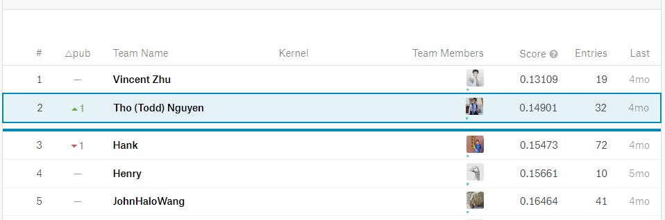
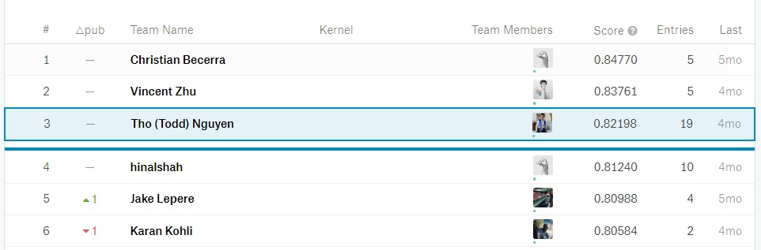

# Overview
Use keras and VGG19 to create Machine Learning models which are trained on data. These models are then used to predict test data.

# Gender Classification
Use a modified VGG19 model to predict a person's gender given their face. In our class, I obtained 2nd place with my model.

# Facial Expression Classification
Use a modified VGG19 model to predict a person's expression given their face. These expressions include happy, sad and neutral. In our class, I obtained 3rd place with my model.

